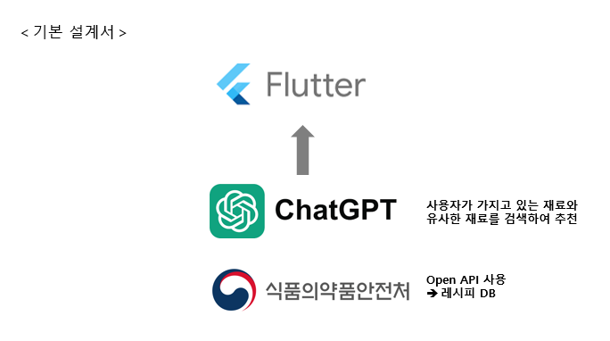

# 🍳 있는대로 (레시피 검색 애플리케이션)

**이 프로젝트는 1인 가구, 자취하는 학생, 또는 요리를 자주 하는 사람들을 위한 레시피 검색 애플리케이션입니다.**

**사용자가 가지고 있는 재료를 기반으로 최적의 요리를 추천하여 음식 낭비를 줄이고, 간편한 요리 경험을 제공합니다.**

## 🌟 주요 기능

### 1. **재료 기반 레시피 검색**
- 사용자가 입력한 재료를 기반으로 관련 레시피를 검색.
- 자동완성 기능으로 빠르고 정확한 재료 입력 가능.

### 2. **재료 대체 추천**
- 사용 가능한 대체 재료를 ChatGPT 기반으로 추천하여 재료 부족 문제 해결.

### 3. **즐겨찾기 기능**
- 마음에 드는 레시피를 북마크하여 언제든지 다시 확인 가능.

### 4. **알레르기 음식 제외 설정**
- 알레르기를 유발할 수 있는 재료를 설정하여 맞춤형 레시피 제공.

## 📱 화면 설계

### 홈 화면
- 사용자가 추가한 재료와 추천받은 레시피를 한눈에 확인 가능.

### 재료 검색 화면
- 재료를 한 글자씩 입력할 때마다 데이터베이스에서 매칭되는 재료를 자동완성.

### 레시피 검색 결과 화면
- 선택한 재료를 포함한 레시피 목록 제공.

### 레시피 상세 정보 화면
- 요리법, 필요한 재료, 조리 시간 등 상세 정보를 제공.

### 즐겨찾기 화면
- 사용자가 즐겨찾기에 추가한 레시피를 쉽게 확인.

### 알레르기 설정 화면
- 알레르기 유발 재료를 설정하고, 이를 제외한 레시피 검색 가능.

## ⚙️ 기술 스택

### 프론트엔드
- **Flutter**: 반응형 UI 구현.

### 백엔드
- **로컬 데이터베이스**: 데이터를 효율적으로 관리하기 위한 로컬 DB 사용.

### 데이터
- **식약처 오픈 API**:
  - 레시피 데이터를 실시간으로 가져와 다양한 요리를 추천.
  - API 호출을 통해 최신 레시피 정보를 제공.

### AI 대체 재료 추천
- **OpenAI ChatGPT API**:
  - 사용자의 재료 부족 상황을 분석하고, 적합한 대체 재료를 추천.
  - 예: "우유가 없는 경우, 두유 또는 코코넛 밀크 사용 가능" 등.
 
## 실행 흐름도

## 🌟 화면 흐름도

1. **홈 화면**
    - 사용자가 현재 가지고 있는 재료를 추가 및 확인할 수 있는 화면입니다.
    - "재료 추가" 버튼을 눌러 원하는 재료를 입력합니다.
    - 추가된 재료를 기반으로 **레시피 검색**을 진행합니다.

2. **검색된 레시피 화면**
    - 사용자가 입력한 재료를 포함한 레시피 목록이 표시됩니다.
    - 각 레시피 항목을 눌러 **레시피 상세 정보**를 확인할 수 있습니다.

3. **상세 레시피 화면**
    - 선택한 레시피의 **조리법**, **필요한 재료**, **조리 시간** 등의 정보를 제공합니다.
    - 사용자는 이 화면에서 레시피를 **즐겨찾기**에 추가할 수 있습니다.

4. **즐겨찾기 화면**
    - 사용자가 북마크한 레시피를 한눈에 확인할 수 있는 화면입니다.
    - 저장된 레시피를 눌러 **상세 레시피 화면**으로 이동합니다.

5. **설정 화면**
    - 사용자는 알레르기 유발 재료 또는 추천받고 싶지 않은 재료를 설정할 수 있습니다.
    - 설정된 재료는 검색 시 제외되어 맞춤형 레시피를 제공합니다.
  
## 기능별 화면

### 재료 입력 화면

### 검색된 레시피 화면

### 레시피 상세 정보 화면

### 대체 재료 안내 회면

### 즐겨찾기 화면

### 알레르기 유발 식품 설정 화면

## 🌍 목표

1. **효율적인 재료 활용**:
   - 사용자가 버리는 재료를 최소화.
2. **빠르고 간편한 요리 추천**:
   - 바쁜 일상에서도 효율적으로 요리 가능.
3. **음식 낭비 감소**:
   - 환경을 생각하는 지속 가능한 요리 문화 확산.

# Getting Started

This project is a starting point for a Flutter application.

A few resources to get you started if this is your first Flutter project:

- [Lab: Write your first Flutter app](https://docs.flutter.dev/get-started/codelab)
- [Cookbook: Useful Flutter samples](https://docs.flutter.dev/cookbook)

For help getting started with Flutter development, view the
[online documentation](https://docs.flutter.dev/), which offers tutorials,
samples, guidance on mobile development, and a full API reference.
